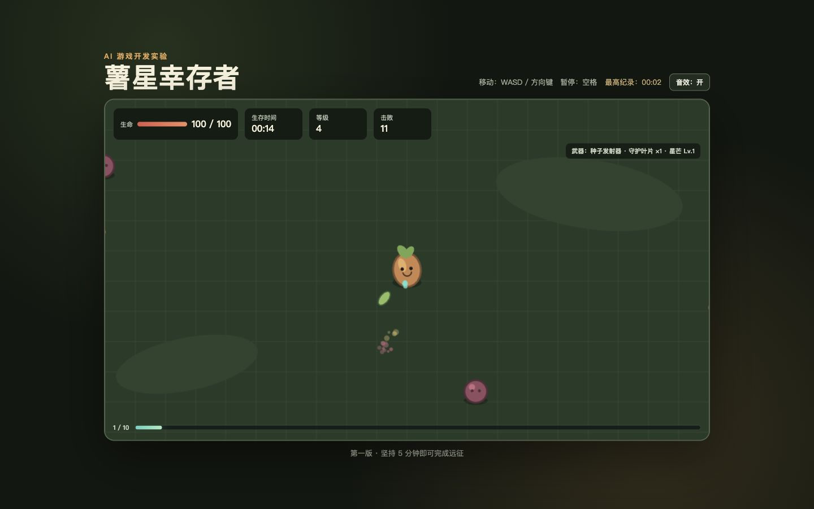

# 薯星幸存者

这是我的第一个 AI 辅助开发游戏项目。

🎮 **在线游玩：<https://chimingyi.github.io/Brotato/>**



游戏是一款原创俯视角自动战斗构筑游戏：玩家控制“薯星探险员”，在短波次中战斗、收集材料、选择升级，并在波次之间购买和合成装备。

> 本项目只参考“幸存者类游戏”的通用玩法。角色、美术、名称、代码和数值都会保持原创，不复制《土豆兄弟》的素材或具体实现。

## 当前进度

线上 v2.4.0 已发布并通过验收：角色拥有移动与攻击动画，玩家和敌方弹丸拥有更清晰的方向与状态特效；万巢母体、风暴星核和岩根泰坦各有三个生命阶段。完整 20 波、无尽第 25 波、三首领阶段和 390 × 844 手机布局均已通过。

## 如何运行

### 最简单的方法

直接双击 `index.html`，用浏览器打开。

### 推荐方法

在项目文件夹中打开终端，输入：

```bash
python3 -m http.server 8000
```

然后访问 <http://localhost:8000>。

## 操作方法

- `W A S D` 或方向键：移动
- `空格`：暂停或继续
- 点击“开始冒险”：开始计时
- 手机：拖动左下角虚拟摇杆
- 点击“音效：开/关”：切换声音

## 项目文件

```text
.
├── index.html          # 网页结构
├── styles.css          # 网页外观
├── src/
│   ├── data.js         # 角色、武器、道具、敌人与波次数据
│   ├── game.js         # 游戏状态、战斗、商店和绘制
│   └── storage.js      # v2 解锁进度、统计和设置存档
└── docs/
    ├── ROADMAP.md      # 后续开发路线
    ├── DEVLOG.md       # 每一步的开发记录
    ├── GAMEPLAY_PARITY_V2.md # v2 完整玩法规格与验收清单
    ├── AI_WORKFLOW.md  # AI 如何参与开发
    ├── PROJECT_SUMMARY.md # 第一版总结
    ├── TESTING.md      # 测试方法和完成度证据
    └── screenshots/    # 实际运行截图
```

## 开发原则

1. 每次只增加一个容易验证的功能。
2. 每完成一步，都更新 `docs/DEVLOG.md`。
3. 先保证好玩和稳定，再增加漂亮素材。
4. AI 写出的代码必须实际运行测试，不能只看起来正确。

## 发布到 GitHub Pages

游戏已经发布到 <https://chimingyi.github.io/Brotato/>。仓库包含 `.github/workflows/deploy-pages.yml`，代码推送到 `main` 后，GitHub Actions 会自动把同一提交同步到 `gh-pages` 发布分支。

如果首次部署没有自动启用 Pages，可以手动检查：

1. 打开仓库的 `Settings`。
2. 在左侧选择 `Pages`。
3. 在 `Build and deployment` 中选择 `Deploy from a branch`，分支选择 `gh-pages`，目录选择 `/ (root)`。
4. 打开仓库的 `Actions` 页面，查看“同步游戏到 GitHub Pages”。
5. 等待工作流显示绿色对勾，游戏网址为 <https://chimingyi.github.io/Brotato/>。

当前代码仓库：[chimingyi/Brotato](https://github.com/chimingyi/Brotato)。
